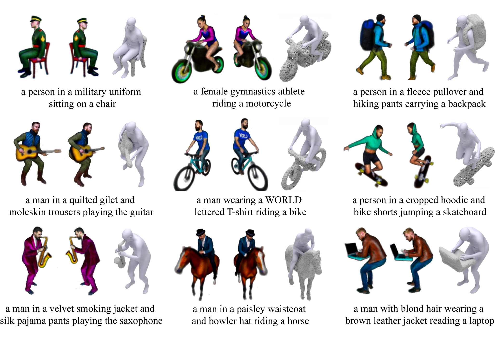

<div align="center">

<h1>InterFusion: Text-Driven Generation of 3D Human-Object Interaction</h1>



<h4>InterFusion can generate diverse 3D scenes of human-object interaction (3D HOI) given texts.</h4>

<h4 align="center">
  <a href="https://arxiv.org/abs/2403.15612" target='_blank'>[arXiv]</a> •
  <a href="https://arxiv.org/pdf/2403.15612.pdf" target='_blank'>[PDF]</a>
</h4>

<!-- This repository contains the official implementation of InterFusion. -->

<strong><h2>:construction: ... Code Coming Soon ... :wrench:</h2></strong>

</div>

### :bulb: Citation
If you find our work useful for your research, please consider citing the paper:
```
@article{dai2024interfusion,
  title={InterFusion: Text-Driven Generation of 3D Human-Object Interaction},
  author={Dai, Sisi and Li, Wenhao and Sun, Haowen and Huang, Haibin and Ma, Chongyang and Huang, Hui and Xu, Kai and Hu, Ruizhen},
  journal={arXiv preprint arXiv:2403.15612},
  year={2024}
}
```